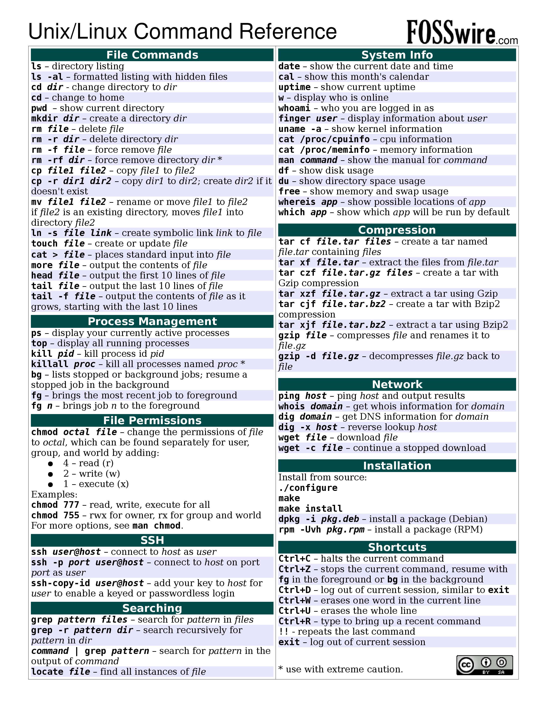

### 参考资源

1. 别人做的简洁版总结图片( **高清图片，请右键新标签页打开** )

2. [命令行的艺术](https://github.com/jlevy/the-art-of-command-line)
3. 当你对一个命令看不懂的时候，可以使用这个网站，查看命令的解析。
[explainshell.com](https://explainshell.com/)
4. [Linux Commands for Beginners](https://youtube.com/playlist?list=PLT98CRl2KxKHaKA9-4_I38sLzK134p4GJ)
